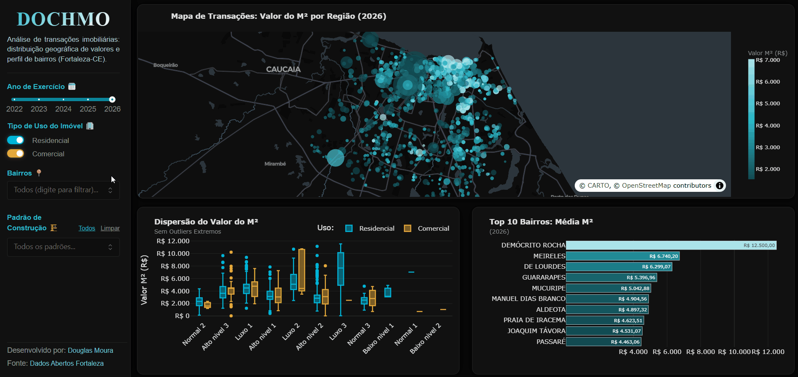

<a name="topo"></a>
# 🏙️ Dashboard Interativo: Análise de ITBI (Fortaleza-CE)

<p align="center">
  <a href="#"></a>
  <a href="#"></a>
  <a href="#"></a>
  <a href="#"></a>
  <a href="https://dados.fortaleza.ce.gov.br/"></a>
  <a href="https://douglas-moura-portfolio.pages.dev"></a>
</p>

Este projeto consiste em uma aplicação analítica interativa de alta performance desenvolvida em **Python** utilizando o framework **Dash (Plotly)**, projetada sob o padrão arquitetural **MVC (Model-View-Controller)**. 

O objetivo central é mapear, explorar e diagnosticar a dinâmica do mercado imobiliário de Fortaleza-CE a partir dos microdados oficiais de transações do **ITBI (Imposto sobre a Transmissão Inter Vivos de Bens Imóveis)**, disponibilizados pelo portal de Dados Abertos da Secretaria Municipal das Finanças (SEFIN). A ferramenta combina inteligência geoespacial, análise estatística de dispersão e rankings dinâmicos de valorização imobiliária em um tema *Dark Mode* sob medida.

---

## 🚀 Atalhos Rápidos

* 💼 **[Acesse o Portfólio Oficial DOCHMO](https://douglas-moura-portfolio.pages.dev)**
* 🏛️ **[Portal de Dados Abertos da Prefeitura de Fortaleza](https://dados.fortaleza.ce.gov.br/)**
* 📓 **[Notebook de Análise Exploratória (EDA)](./scripts/analise_exploratoria_itbi.ipynb)**
* ⚙️ **[Script de ETL e Filtragem de Dados](./scripts/script_filter.ipynb)**

---

## 📸 Demonstração da Aplicação



*Interface da aplicação Dash: (1) Mapa geoespacial com gradiente contínuo de valor/m² e dimensionamento por área construída; (2) Análise de dispersão por padrão construtivo com segmentação residencial/comercial; e (3) Ranking dos bairros mais valorizados de Fortaleza sob o filtro ativo.*

---

## 📊 Contexto de Negócio & Metodologia Analítica

### O que é o ITBI?
O **ITBI** é o tributo municipal incidente sobre operações onerosas de transferência de bens imóveis entre pessoas vivas. Por refletir transações formalizadas e avaliadas pelo Fisco municipal, sua base histórica configura um dos termômetros mais precisos e fidedignos para a mensuração de preços e liquidez do mercado imobiliário urbano.

### Indicadores e Modelagem de Variáveis
A métrica mestra de valorização territorial adotada no projeto é o **Valor Médio do Metro Quadrado ($R\$/m^2$)**, computado a partir da razão entre o valor venal da base de cálculo e a área edificada registrada:

$$\text{Valor do } M^2 = \frac{\text{Valor da Base de Cálculo } (R\$)}{\text{Área Edificada } (m^2)}$$

### Tratamento Estatístico de Outliers e Assimetria
Transações imobiliárias frequentemente exibem distribuições assimétricas com caudas pesadas à direita (propriedades de altíssimo padrão, coberturas de luxo ou erros de digitação cadastral). Para assegurar a legibilidade e a fidelidade visual sem mascarar o comportamento geral do mercado:

1. **Normalização do Mapa Espacial ($P_5$ a $P_{95}$):** O gradiente de cores contínuo (*Teal Scale*) é delimitado pelos percentis 5% e 95% do valor do $m^2$, evitando que transações anômalas saturem a escala visual.
2. **Filtragem Interquartil no Boxplot ($P_{99}$):** Na análise de dispersão por padrão de construção, registros com valores acima do percentil 99 são isolados da escala principal para evidenciar a mediana, os quartis ($Q_1, Q_3$) e a amplitude interquartil (IQR) típica de cada segmento construtivo.

---

## 🎯 Funcionalidades & Experiência do Usuário

* **🎛️ Filtros Dinâmicos Integrados:**
  * **Exercício (Ano):** Slider temporal contínuo para avaliação evolutiva das transações imobiliárias.
  * **Tipo de Uso:** Segmentação instantânea entre imóveis *Residenciais* (Azul `#00B4D8`) e *Comerciais* (Dourado `#E5A93B`).
  * **Padrão Construtivo:** Seleção granular (Baixo, Normal, Superior, Luxo, etc.) com botões de ação rápida (*"Selecionar Todos"* e *"Limpar"*).
  * **Bairros:** Busca textual inteligente com *autocomplete* e seleção múltipla.

* **🗺️ Inteligência Geoespacial (Spatial Analytics):**
  * Renderização em malha escura (*Carto Darkmatter*) via Plotly Mapbox.
  * Coordenadas georreferenciadas (Latitude / Longitude) com raios de círculos proporcionais à área edificada ($m^2$).
  * *Tooltips* informativos com formatação monetária brasileira (R$).

* **📦 Análise de Dispersão e Variabilidade (Boxplot):**
  * Comparativo do valor do $m^2$ entre diferentes tipologias de acabamento e uso.
  * Identificação de assimetria de distribuição e concentração de preços por padrão.

* **🏆 Ranking de Bairros (Top 10 Valorização):**
  * Gráfico de barras horizontais com reordenação dinâmica e rótulos de valores embutidos (*inside labels*).
  * Adaptação automática do título e escala conforme o volume de bairros selecionados.

---

## ⚡ Engenharia de Performance & Arquitetura MVC

Para garantir tempos de resposta submilissegundo e modularidade de código de nível produtivo, o ecossistema foi estruturado no padrão **MVC**:

```
 ┌────────────────────────────────────────────────────────┐
 │                       app.py                           │
 │        (Entry-point, MantineProvider & Server)         │
 └──────────────────────────┬─────────────────────────────┘
                            │
        ┌───────────────────┴───────────────────┐
        ▼                                       ▼
 ┌──────────────┐                       ┌──────────────┐
 │  layout.py   │                       │ callbacks.py │
 │   (View)     │                       │ (Controller) │
 └──────┬───────┘                       └───────┬──────┘
        │                                       │
        └───────────────────┬───────────────────┘
                            ▼
                  ┌───────────────────┐
                  │  data_manager.py  │
                  │      (Model)      │
                  └───────────────────┘
```

### Principais Decisões Arquiteturais:
1. **Client-Side State Management (`dcc.Store`):** Os dados filtrados são mantidos em memória no navegador do cliente (*Client-Side Caching*). O backend executa o filtro relacional uma única vez por interação e dispara a atualização paralela dos 3 gráficos simultaneamente, eliminando requisições redundantes de I/O.
2. **Vetorização com Pandas & NumPy:** Substituição integral de iterações por máscaras booleanas vetorizadas e conversões com `pd.to_numeric(..., errors='coerce')` para mitigar exceções na engine JavaScript do Plotly.
3. **Algoritmo de Ticks Humanizados (*Nice Numbers*):** Módulo utilitário baseado em logaritmos de magnitude (`math.log10`) que gera escalas com divisões arredondadas (1, 2, 5 ou 10) e formatação monetária sem poluição visual.
4. **UI/UX Moderna e Consistente:** Combinação de `dash_mantine_components` (para controles sofisticados de formulário e tema escuro) e `dash_bootstrap_components` (Tema Cyborg com CSS customizado).

---

## 📂 Estrutura do Repositório

```text
dash_analise_itbi_fortaleza_V2/
├── README.md                                            # Documentação completa do projeto (esta página)
├── requirements.txt                                     # Pacotes e dependências Python para execução
├── dash_analise_itbi_fortaleza_V2.gif                   # Demonstração visual animada da aplicação
├── dataset/                                             # Camada de armazenamento dos dados
│   ├── dados_abertos_itbi_transacoes_imobiliarias.xlsx  # Base bruta (Portal de Dados Abertos)
│   └── dataset_filtered.xlsx                            # Base higienizada consumida pelo Dashboard
├── projeto_analise_itbi/                                # Código-fonte modular da aplicação Dash (MVC)
│   ├── assets/
│   │   └── style.css                                    # Folha de estilos CSS (Classes Dark Mode e Layout)
│   ├── data_manager.py                                  # Model: Ingestão, tipagem e constantes globais
│   ├── layout.py                                        # View: Construção dos componentes e grid visual
│   ├── callbacks.py                                     # Controller: Reatividade, filtros e gráficos Plotly
│   └── app.py                                           # Entry-point: Instanciação do servidor e provedores
└── scripts/                                             # Cadernos de prototipação e engenharia analítica
    ├── analise_exploratoria_itbi.ipynb                  # EDA: Análise estatística e descobertas iniciais
    └── script_filter.ipynb                              # ETL: Tratamento, higienização e exportação
```

---

## 💻 Como Executar a Aplicação Localmente

### Pré-requisitos
* Python **3.10+** instalado.
* Gerenciador de pacotes `pip` atualizado.

### 1. Clonar o Repositório
```bash
git clone https://github.com/douglascmoura/dash_analise_itbi_fortaleza_V2.git
cd dash_analise_itbi_fortaleza_V2
```

### 2. Configurar o Ambiente Virtual (Recomendado)
* No Windows:
  ```bash
  python -m venv venv
  .\venv\Scripts\activate
  ```
* No Linux/MacOS:
  ```bash
  python3 -m venv venv
  source venv/bin/activate
  ```

### 3. Instalar Dependências
```bash
pip install -r requirements.txt
```

### 4. Inicializar o Dashboard
```bash
python projeto_analise_itbi/app.py
```

Em seguida, abra o navegador e acesse:
```
http://127.0.0.1:8050/
```

---

## ✍🏽 Autor

<table align="center">
  <tr>
    <td align="center" width="150px">
      <br />
      <sub><b>Douglas Chaves Moura</b></sub>
    </td>
    <td>
      <p>Estatístico, pesquisador e cientista de dados idealizador do ecossistema <b>DOCHMO</b>. Atuando no desenvolvimento de soluções analíticas quantitativas, análise espacial e visualização de dados de alta performance aplicada à ciência de dados.</p>
      <p align="left">
        <a href="https://github.com/douglascmoura"></a>
        <a href="https://www.linkedin.com/in/douglas-chaves-moura/"></a>
        <a href="mailto:douglascmoura21@gmail.com"></a>
        <a href="https://douglas-moura-portfolio.pages.dev/"></a>
      </p>
    </td>
  </tr>
</table>

<p align="right"><a href="#topo">🔼 Voltar ao topo</a></p>